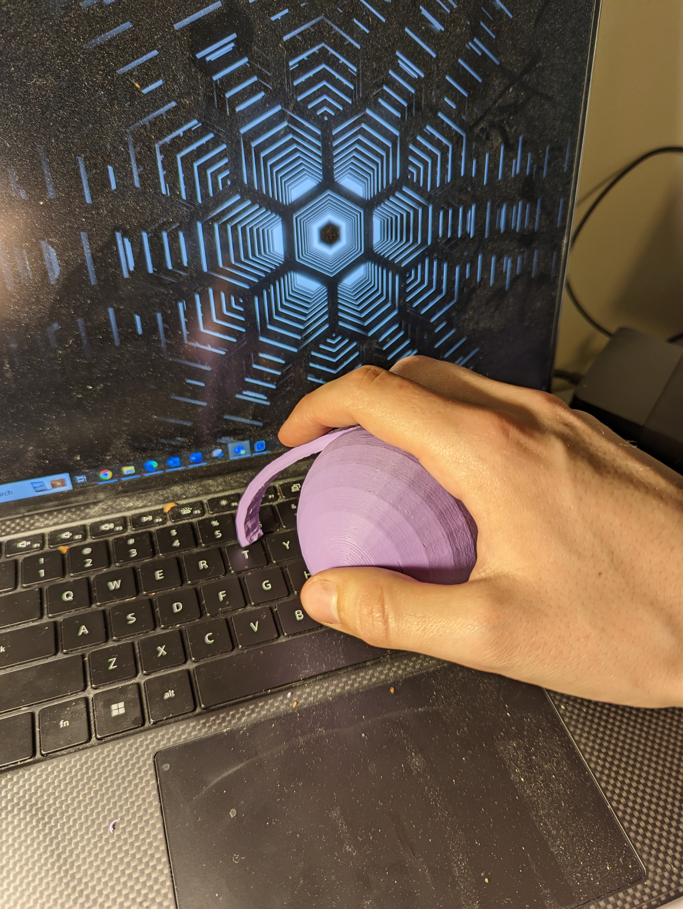

# Arthritis Typing Aid
The Arthritis Typing Aid is a ball stylus that allows users with arthritis to type without pain. This device is intended for users with arthritis that have difficulty typing due to joint pain. The ball of the device provides an easy grip, while the stylus allows for the user to type.

The Arthritis Typing Aid was designed by Alec Stilwell and published on [MyMiniFactory](https://www.myminifactory.com/object/3d-print-arthritis-typing-aid-77579). 

## Makers Making Change Assistive Device Library
https://www.makersmakingchange.com/s/product/arthritis-typing-aid/01tJR00000092YrYAI

## How to Obtain an Arthritis Typing Aid
### 1. Do it Yourself (DIY) or Do it Together (DIT)

This is an open-source assistive technology, so anyone is free to build it. All of the files and instructions required to build the Arthritis Typing Aid are contained within this repository. Refer to the Maker Checklist below.

### 2. Request a build of this device

If you would like to obtain an Arthritis Typing Aid, you may submit a build request through the [MMC Library Page](https://www.makersmakingchange.com/s/product/arthritis-typing-aid/01tJR00000092YrYAI). The requestor is responsible for the cost of materials and any shipping.

### 3. How to build this device for someone else

If you have the skills and equipment to build this device, and would like to donate your time to create the switch for someone who needs it, visit the [MMC Maker Wanted](https://makersmakingchange.com/maker-wanted/) section.

## Getting Started

### 1. Read the Makers Checklist

[The Makers Checklist] 

### 2. Order the Off-The-Shelf Components

The [Bill of Materials](/Documentation/Arthritis_Typing_Aid_BOM_V1.0.xlsx) lists all of the parts and components required to build the Arthritis Typing Aid. 

### 3. Print the 3D Printable components

All of the files and individual print files can be in the [/Build_Files/3D_Printing_Files](/Build_Files/3D_Printing_Files/) folder.

### 4. Assemble the Arthritis Typing Aid

Reference the [Assembly Guide](/Documentation/Arthritis_Typing_Aid_Assembly_Guide_V1.0.pdf) for the tools and steps required to build each portion.

## Files
### Documentation
| Document             | Version | Link |
|----------------------|---------|------|
| Design Rationale     | 1.0     | [Arthritis_Typing_Aid_Design_Rationale](/Documentation/Arthritis_Typing_Aid_Design_Rationale_V1.0.pdf)     |
| Maker Checklist      | 1.0     | [Arthritis_Typing_Aid_Maker_Checklist](/Documentation/Arthritis_Typing_Aid_Maker_Checklist_V1.0.pdf)     |
| Bill of Materials    | 1.0     | [Arthritis_Typing_Aid_Bill_of_Materials](/Documentation/Arthritis_Typing_Aid_BOM_V1.0.xlsx)     |
| 3D Printing Guide    | 1.0     | [Arthritis_Typing_Aid_3D_Printing_Guide](/Documentation/Arthritis_Typing_Aid_3D_Printing_Guide_V1.0.pdf)     |
| Assembly Guide       | 1.0     | [Arthritis_Typing_Aid_Assembly_Guide](/Documentation/Arthritis_Typing_Aid_Assembly_Guide_V1.0.pdf)     |
| User Guide           | 1.0     | [Arthritis_Typing_Aid_User_Guide](/Documentation/Arthritis_Typing_Aid_User_Guide_V1.0.pdf)    |
| Changelog            | 1.0     | [Arthritis_Typing_Aid_Changelog](/Documentation/Arthritis_Typing_Aid_Changelog_V1.0.pdf)     |

### Design Files
 - [CAD Files](/Design_Files)

### Build Files
 - [3D Printing Files](/Build_Files/3D_Printing_Files)

## Attribution
 - Design by [Alec Stilwell @astilwell - MyMiniFactory](https://www.myminifactory.com/users/astilwell)
 - Documentation by Neil Squire Society/Makers Making Change 

## License
Everything needed or used to design, make, test, or prepare the Arthritis Typing Aid is licensed under the [MyMiniFactory - Credit - Remix - Noncommercial](https://www.myminifactory.com/object-licensing).

Accompanying material such as instruction manuals, videos, and other copyrightable works that are useful but not necessary to design, make, test, or prepare the Arthritis Typing Aid are published under a Creative Commons Attribution-ShareAlike 4.0 license https://creativecommons.org/licenses/by-sa/4.0/ (CC BY-SA 4.0).

Source Location: https://github.com/makersmakingchange/Arthritis-Typing-Aid

---

## About Makers Making Change

Makers Making Change is a program of [Neil Squire](https://www.neilsquire.ca/), a Canadian non-profit that uses technology, knowledge, and passion to empower people with disabilities.

Makers Making Change leverages the capacity of community based Makers, Disability Professionals and Volunteers to develop and deliver affordable Open Source Assistive Technologies.

 - Website: [www.MakersMakingChange.com](https://www.makersmakingchange.com/)
 - GitHub: [makersmakingchange](https://github.com/makersmakingchange)
 - X (formerly Twitter): [@makermakechange](https://twitter.com/makermakechange)
 - Instagram: [@makersmakingchange](https://www.instagram.com/makersmakingchange)
 - Facebook: [makersmakechange](https://www.facebook.com/makersmakechange)
 - LinkedIn: [Neil Squire Society](https://www.linkedin.com/company/neil-squire-society/)
 - Thingiverse: [makersmakingchange](https://www.thingiverse.com/makersmakingchange/about)
 - Printables: [MakersMakingChange](https://www.printables.com/@MakersMakingChange)

### Contact Us
For technical questions, to get involved, or to share your experience we encourage you to [visit our website](https://www.makersmakingchange.com/) or [contact us](https://www.makersmakingchange.com/s/contact).

